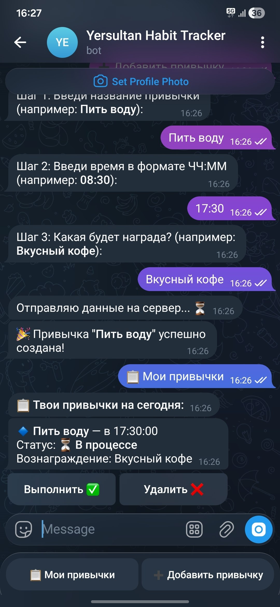
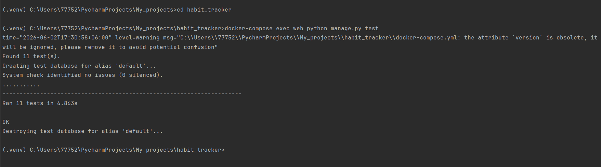
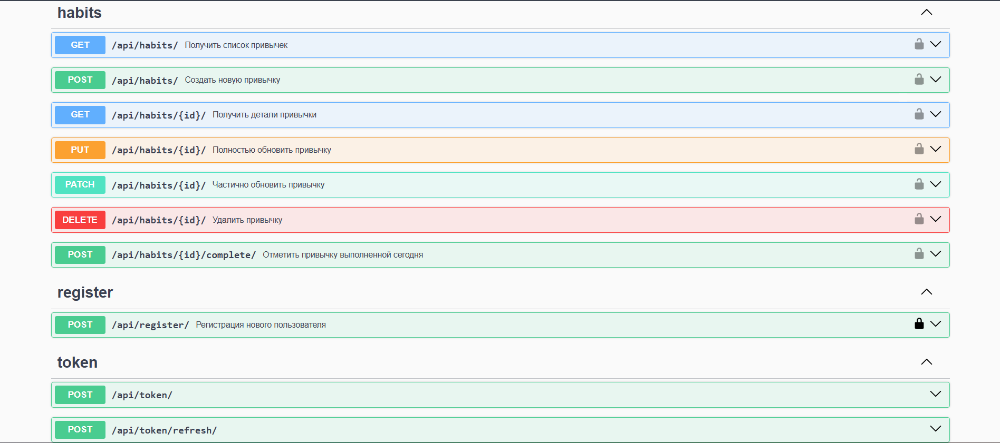

# Habit Tracker (Django + Telegram Bot + Celery)

Микросервисное приложение для управления привычками с REST API, Telegram Bot интерфейсом и системой автоматических уведомлений.

Проект реализован с использованием Django REST Framework, PostgreSQL, Redis, Celery и Docker Compose.

---

## 🚀 Key Features

- REST API (Django REST Framework)
- Telegram Bot (Aiogram)
- JWT Authentication
- CRUD для привычек
- Бизнес-логика контроля выполнения привычек
- Защита от IDOR (изоляция пользователей)
- Celery + Celery Beat (фоновые задачи и расписания)
- Автоматические уведомления в Telegram
- Dockerized environment
- Swagger / OpenAPI documentation
- Automated API testing

---

## 🧱 Tech Stack

**Backend:**
- Python 3.11
- Django 4.2
- Django REST Framework

**Database:**
- PostgreSQL
- Redis

**Async / Background tasks:**
- Celery
- Celery Beat

**Bot:**
- Aiogram 3
- HTTPX

**DevOps:**
- Docker
- Docker Compose

**Testing:**
- Django APITestCase
- Integration Testing
- Security Testing (IDOR)
- Business Logic Testing

---

## 📦 Architecture

```text
Client (Telegram)
        ↓
Telegram Bot (Aiogram)
        ↓
Django REST API
        ↓
PostgreSQL / Redis
        ↓
Celery Workers + Beat
        ↓
Telegram Bot
```

---

## ⚡ Quick Start

### 1. Clone project

```bash
git clone <repo_url>
cd habit_tracker
```

### 2. Create `.env`

```env
SECRET_KEY=your_secret_key

POSTGRES_DB=habit_tracker
POSTGRES_USER=postgres
POSTGRES_PASSWORD=postgres
POSTGRES_HOST=db
POSTGRES_PORT=5432

TELEGRAM_BOT_TOKEN=your_token
```

### 3. Run project

```bash
docker-compose up -d --build
```

---

## 🌐 Services

| Service | URL |
|--------|-----|
| API | http://localhost:8000/api/habits/ |
| Swagger | http://localhost:8000/api/docs/swagger/ |
| Admin | http://localhost:8000/admin/ |

---

## 📱 Интерфейс Telegram-бота

<p align="center">
  
</p>

## 🧪 Testing

Проект покрыт автоматизированными интеграционными тестами.
### Результат выполнения автотестов:


### Run tests

```bash
docker-compose exec web python manage.py test
```

### Coverage includes

- Authentication & Authorization
- CRUD operations
- Business rules validation
- IDOR security tests
- Integration (Telegram ↔ API)

### Документация Swagger (OpenAPI)


### Metrics

| Metric | Value |
|--------|------|
| Automated Tests | 11 |
| Bug Reports | 4 |
| Critical Issues | 0 |
| Security Scenarios | 4 |

---

## 🧾 QA Documentation

Полный QA пакет включён в проект:

- 📋 Test Plan
- 🎯 Test Cases
- 🐛 Bug Reports Log
- 🔗 Traceability Matrix
- 📊 API Coverage Report

---

## ⚙️ Celery & Notifications

Проект использует асинхронную систему задач:

### Celery

- выполнение фоновых задач
- обработка логики уведомлений

### Celery Beat

- планировщик задач
- периодическая проверка привычек

### Flow уведомлений:

1. Celery Beat запускает задачу по расписанию
2. Celery worker обрабатывает задачи
3. Проверяются привычки пользователей
4. Отправляется уведомление в Telegram Bot

---

## 🔐 Security Highlights

- JWT Authentication
- User isolation (anti-IDOR protection)
- Secure query filtering
- Safe Telegram message parsing (HTML mode)
- Docker network isolation

---

## 🧠 Key Engineering Decisions

- Использование Django Signals для автоматического создания профиля пользователя
- Разделение bot / backend / worker сервисов
- Celery для асинхронных уведомлений
- Redis как брокер задач
- Docker Compose для полной изоляции окружения

---

## 📌 QA Artifacts

✔ Test Plan  
✔ Test Cases  
✔ Bug Reports  
✔ Traceability Matrix  
✔ API Coverage  
✔ Automated Tests  
✔ Security Testing

---

## 🔮 Future Improvements

- GitHub Actions CI/CD pipeline
- Pytest migration
- Test coverage report (coverage.py)
- Load testing (Locust)
- Monitoring (Prometheus + Grafana)
- Production deployment (Nginx + Gunicorn)

---

## 🎯 Summary

Этот проект демонстрирует:

- разработку REST API на Django
- интеграцию Telegram Bot
- работу с PostgreSQL и Redis
- асинхронные задачи через Celery
- построение Docker окружения
- автоматизированное тестирование API
- QA документацию уровня реального проекта
- практики безопасной разработки

---